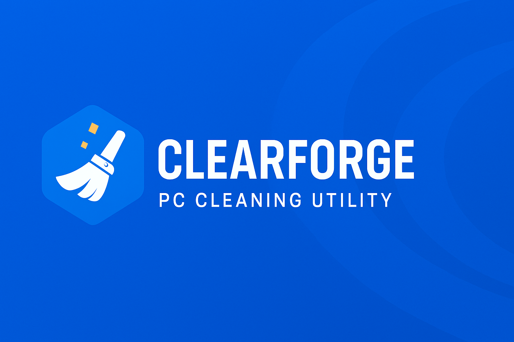

# CLEARFORGE

Enterprise Windows Optimization System
Developed by Tech Labes
A Dresbach Group Company

## Overview

Clearforge is a professional Windows optimization and system maintenance platform built with .NET architecture.
It combines a modular kernel engine, enterprise-grade backend services and a structured licensing system to deliver performance, stability and security for individual and corporate environments.

Clearforge is designed to operate with clean architecture principles, scalable API services and a modern Windows interface.

## Company

Clearforge is developed and maintained by Tech Ops Engineering, under the corporate structure of:

**Dresbach Group**
Canada-based technology holding company

**Founder & Lead Architect:**
Marcos Vinicius Dresbach do Amaral

The Dresbach Group operates in software engineering, infrastructure systems, enterprise tools and technology solutions.

## Architecture

Clearforge follows a modular enterprise architecture built on .NET 9.

### Core Components

*   **Clearforge.App** (Windows Application – WinUI / WPF)
*   **Clearforge.Core** (Optimization Engine)
*   **Clearforge.Api** (ASP.NET Core Web API)
*   **Clearforge.Domain** (Business Rules)
*   **Clearforge.Infrastructure** (Persistence & Services)
*   **Clearforge.Portal** (Blazor Web – future expansion)

**Architecture Style:**
*   Clean Architecture
*   Separation of Concerns
*   Domain-Driven Structure

## Main Features

### System Optimization

*   Temporary file cleanup
*   Cache removal
*   System log cleanup
*   Windows Update residual removal

### Performance Management

*   Startup program manager
*   Service optimization
*   Memory analysis
*   CPU usage monitoring

### Privacy Control

*   Browser data cleaning
*   DNS cache flush
*   Clipboard clearing
*   Activity logs

### Enterprise Capabilities

*   License validation via API
*   Subscription management
*   Stripe integration
*   Audit logs
*   Version control system

## Technology Stack

**Backend:**

*   .NET 9
*   ASP.NET Core Web API
*   Entity Framework Core
*   PostgreSQL

**Desktop:**

*   WinUI 3 / WPF

**Web Portal:**

*   Blazor (planned)

**Security:**

*   JWT Authentication
*   Encrypted license validation
*   Code signing (production builds)

## Repository Structure

```
Clearforge.sln
└── src
    ├── Clearforge.Api
    ├── Clearforge.Application
    ├── Clearforge.Core
    ├── Clearforge.Domain
    ├── Clearforge.Infrastructure
    └── Clearforge.Licensing
```

## Licensing

Clearforge operates under a commercial license model.

**Available Editions:**

*   Base
*   Pro
*   Advanced
*   Enterprise

License validation and activation are handled through secure API endpoints.

## Development Status

**Current Phase:**
Product Structuring & Engineering Integration. The project has been successfully refactored from a placeholder name to its official Clearforge branding.

**Next Milestones:**

*   API stabilization
*   Licensing system implementation
*   Production build pipeline
*   Enterprise deployment structure

## Contact

**Dresbach Group**
Canada

For enterprise partnerships and licensing inquiries, contact the official corporate channels.

## Legal Notice

Clearforge is a proprietary software system.
All rights reserved © Dresbach Group.

Unauthorized reproduction, modification or redistribution is prohibited without written authorization.
